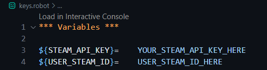

### Steam User Data RPA Bot

## Introduction
Present the steam user data gathered with steam API on an html document which includes basic user information, list of their games with playtime and a plot counting which genre the user plays most.

## How it looks:


## Tools Used
Python
Robot Framework
Pandas
Matplotlib
Steam API
JSON
CSV
HTML Document

## How it works
For a detailed explanation of how the scripts work, refer to the comments inside the files.

The main task used to run the script is located in 'main.robot' and is named 'Gather Data and Create a Document'. The first function within this task is 'Produce Data', which requires two arguments: 'steam api key' and 'steam id'. You can find a way to manage your key in the 'About the Keys' section.

The function begins by creating a sorted CSV file for the user's owned games, which is imported and created from the 'owned_games.robot' file within the project folder. In it, an API call is made and the JSON result is converted to CSV, removing unnecessary data and converting playtime from minutes to hours. The next function, imported from 'player_summaries.robot', makes an API call for user details such as name, avatar, creation date, etc. The JSON result is converted to CSV and excess data is removed. Unix time is converted to date for the 'last log off' and 'time created' columns, and the user's online status is converted from numbers to actual status names (online, offline, busy, away, etc.).

Next, the second function, 'Produce Plot Data and Create HTML', creates a plot by extracting information from the 'games.json' dataset and counting the number of games in a specific genre in the user's game library (more details in the 'About the Dataset' section). The returned data is then passed to the 'generate_plot.py' Python script, which uses 'Matplotlib' to create a plot. Finally, an HTML document is created to present all the generated data. The 'make_html.py' function, using the 'Pandas' library, converts the CSV to HTML and combines the user's Steam data and the plot on a single HTML page. It also includes a link to another page containing a list of the user's games and their playtime in hours.

Open the document found inside output folder called 'user_doc.html'.

If the serached user has a private account, information shown on the document will be limited to the public data only.

## About the Dataset
Dataset has information about most games from the steam store, more precisely the genres and prices of the games.
Dataset used to get the game genres has been downloaded from: https://www.kaggle.com/datasets/fronkongames/steam-games-dataset
Data is old a few months so the newer games that aren't found are skipped.
Due to the overwhelming amount of unneeded data, 'modify_dataset.py' is used independently to remove uneeded information and drastically lower the size of the json file.

## About the Keys
Create a new file in the project folder called 'keys.robot', it is already listed in .gitignore and imported in main.robot. This is how it should look like:

Also you can replace the '${STEAM_API_KEY}' and '${USER_STEAM_ID}' arguments for the 'Produce API Data' directly in the 'main.robot' file with the key and steam id.
Better yet you can check this article from Robocorp about how to hide your secrets: https://robocorp.com/docs/courses/software-robot-project-workflow/hiding-the-secrets

## Setup
1. Install these two extensions for Visual Studio Code:
- ```https://marketplace.visualstudio.com/items?itemName=robocorp.robocorp-code```
- ```https://marketplace.visualstudio.com/items?itemName=robocorp.robotframework-lsp```

2. Clone the repository:
- ```git clone https://github.com/toniilic1/Steam-User-Data-RPA-Bot.git``

3. Get a Steam API key:
- Go to ```https://steamcommunity.com/dev/apikey```
- Log into your steam account
- For a domain name type in ```localhost```
- Refer to 'About the Keys' and input your api key and steam id key you want to get data from.

4. Run the script:
- Open ```main.robot``` withv Visual Studio Code.
- Wait on conda.yaml to get all the dependencies.
- Open the Command Pallete (ctrl+shift+p - by default) or go into View -> Command Palette.
- Find and enter: ```Robocorp: Run Robot``` command.
- When all the tests have passed go into the project folder -> output -> user_doc.html.
- Open the document in your browser.

## License
Apache 2.0